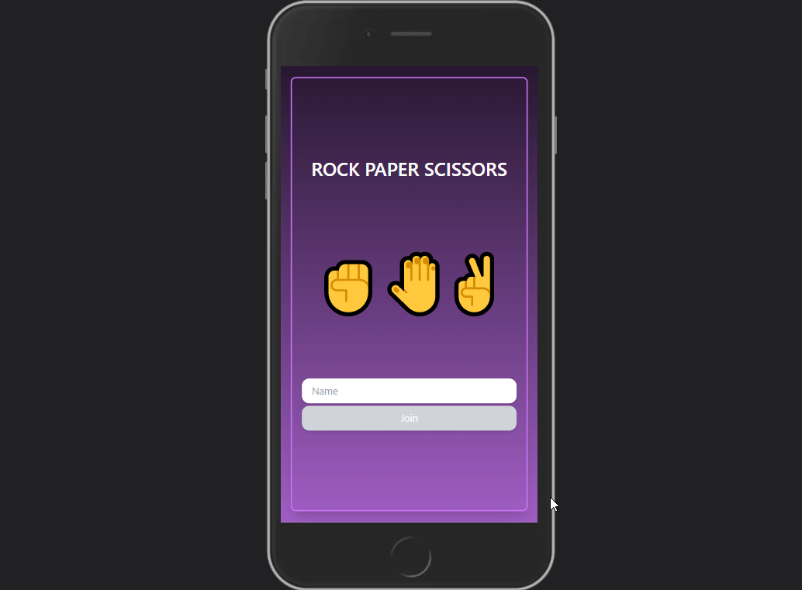

# Rock Paper Scissor GAME

## Description

A PWA where the user can play a classic game and keep the score.

Coding task for BBVA



## Table of Contents (Optional)

- [Installation](#installation)
- [Usage](#usage)
- [Demo](#demo)
- [Test](#test)

## Installation

```
npm install
npm start
```

## Usage

1. Log In with a user name
2. If is the first time your score will be at 0
3. If you are a previous player you will see your score
4. Select your choice and fight against the machine.
5. You can select Lazor Spock variant from the modal.

## Demo

[Demo](https://rockpaperscissor-test.netlify.app/)

[](https://app.netlify.com/sites/rockpaperscissor-test/deploys)

## Test

You can run all the test with:

```
npm run test
```

Also you can check the test coverage with:

```
npm run test:coverage
```

---

## Features

- Include vibration on mobile devices
- Include game: rock, paper, scissor, lazor, spock
